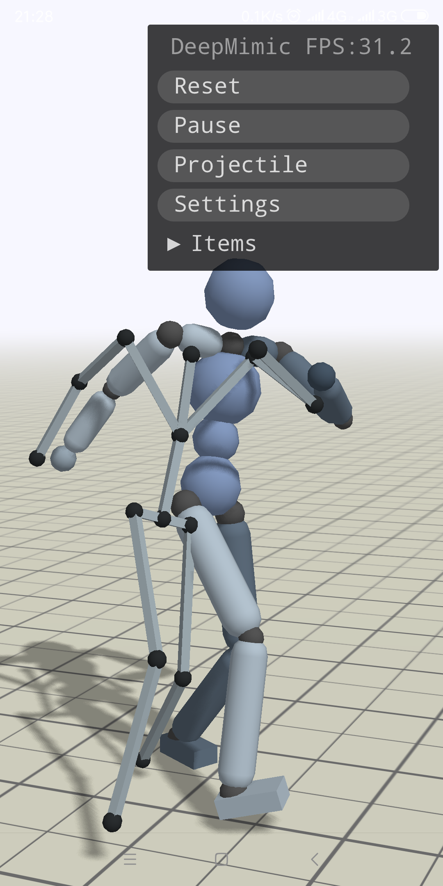

# DeepMimic4Droid
A DeepMimic Demo run on android, modify from DeepMimic/Core(xbpeng)

Code accompanying the SIGGRAPH 2018 paper:
"DeepMimic: Example-Guided Deep Reinforcement Learning of Physics-Based Character Skills".
The framework uses reinforcement learning to train a simulated humanoid to imitate a variety
of motion skills from mocap data.

This project base on DeepMimic: https://xbpeng.github.io/projects/DeepMimic/index.html

## Dependencies
C++:
- Bullet 2.87 (https://github.com/bulletphysics/bullet3/releases)
- Eigen (http://www.eigen.tuxfamily.org/index.php?title=Main_Page)
- OpenBLAS (https://github.com/xianyi/OpenBLAS)
- gles3+
